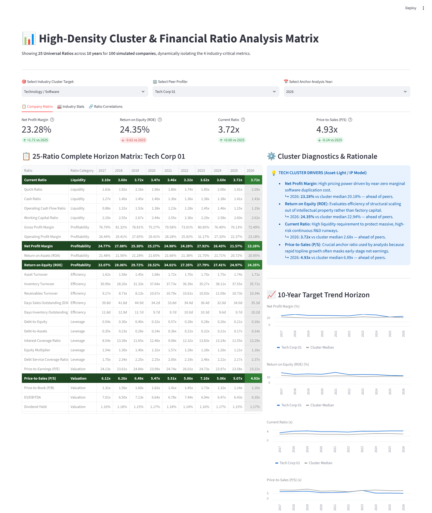
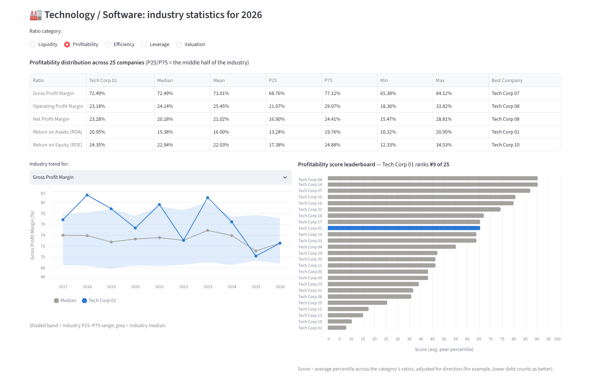
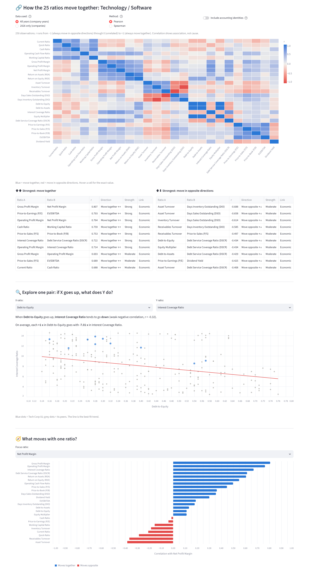

# Cluster & Financial Ratio Analysis Dashboard

A Streamlit dashboard that shows **25 universal financial ratios** for **100 simulated companies** (4 industries × 25 companies) over **10 years (2017–2026)**. For each industry it highlights the 4 ratios that matter most, and a reasoning engine explains why.



| Industry stats | Ratio correlations |
|---|---|
|  |  |

## Features

| Component | Where | What it does |
|---|---|---|
| 25 universal ratios | `ratio_engine.RATIO_SPECS` | 5 categories (Liquidity, Profitability, Efficiency, Leverage, Valuation) × 5 ratios. Each ratio has a unit (`x`, `%`, days), a typical range and a direction (higher or lower is better). |
| 4 industry highlight matrices | `ratio_engine.INDUSTRY_HIGHLIGHTS` | Technology, Retail, Heavy Manufacturing and Banking each light up 4 driver ratios in emerald. The other 21 rows fade to grey. The anchor-year column is tinted. |
| Simulated 10-year data | `ratio_engine.generate_dataset()` | Seeded and reproducible. Ratios are driven by 5 hidden factors (profitability, leverage, liquidity, efficiency, market sentiment), so they move together the way real ratios do: more debt goes with weaker interest coverage, for example. Each industry has its own ranges (`INDUSTRY_PROFILES`; banks run 8–15x leverage and hold no inventory). Five ratios are calculated exactly from others (`DERIVED_RATIOS`), e.g. ROE = ROA × Equity Multiplier and DSO = 365 / Receivables Turnover. |
| Driver reasoning engine | `ratio_engine.INSIGHTS_ENGINE`, `build_insight_markdown()` | Gives the rationale for each driver ratio, plus the selected company's anchor-year value against the cluster median ("ahead of" / "behind" peers). |
| Scorecards & trends | `app.py` → *Company Matrix* tab | Shows each driver's anchor-year value, the change from the previous year and the company's percentile among peers. Also draws a 10-year line chart of the company against the cluster median. |
| Industry stats | *Industry Stats* tab | Pick a category (Profitability, Liquidity, …). You get the industry's median, mean, P25/P75, min/max and best company for each ratio; a 10-year industry trend band with the selected company on top; a category-score leaderboard of all 25 companies; and the 4 industries' medians side by side. |
| Ratio correlations | *Ratio Correlations* tab | A 25 × 25 correlation heatmap (Pearson or Spearman, all years or one year). Also lists the strongest pairs that move together and the strongest that move in opposite directions, with ratios that are linked by definition filtered out. A pair explorer explains in plain English what Y does when X goes up, with a scatter plot and best-fit line. A "what moves with this ratio" chart ranks the other 24 ratios. |

## Run

```bash
pip install -r requirements.txt
streamlit run app.py
```

## Test

```bash
pip install -r requirements.txt -r requirements-dev.txt
pytest -q
```

The tests cover:
- the ratio and industry definitions
- the dataset's shape, bounds, reproducibility and industry differences
- the accounting identities
- that correlation signs are realistic (e.g. leverage vs interest coverage is negative)
- the industry statistics
- the highlight styling and unit formatting
- a headless `AppTest` run that clicks through every industry, category and correlation option

> The data is simulated. The correlations show how the simulation links the ratios, not findings about real companies.
